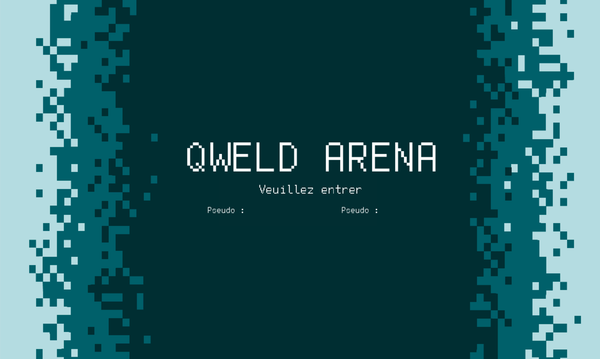
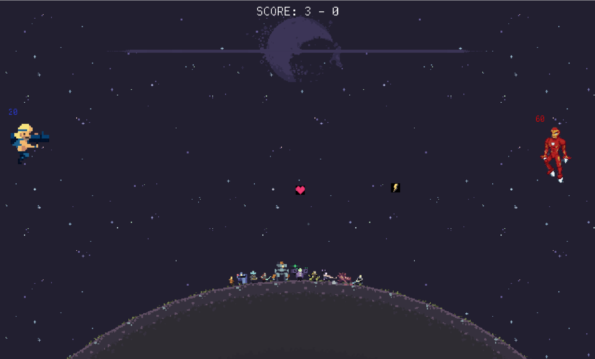

# Projet de Mini-Jeu en Python sur le Thème de l'Espace

## Introduction

Ce projet est un travail scolaire réalisé en Terminale, dans le cadre de la spécialité NSI (Numérique et Sciences Informatiques). L'objectif était de créer un mini-jeu en Python sur le thème de notre choix. J'ai choisi d'explorer le thème de l'espace pour ce projet.

## Description du Projet

Le projet consiste en un mini-jeu de combat spatial en mode 1 contre 1. Les joueurs s'affrontent dans l'espace, pilotant chacun leur propre vaisseau spatial. L'objectif est de détruire le vaisseau adverse tout en évitant les attaques ennemies.

## Fonctionnalités

- **Choix du Thème :** Le jeu est basé sur le thème de l'espace, offrant ainsi un environnement spatial futuriste.
- **Mode de Jeu 1vs1 :** Deux joueurs s'affrontent directement dans des combats spatiaux intenses.
- **Combat Spatial :** Les joueurs contrôlent leur vaisseau et utilisent des armes pour attaquer et détruire l'adversaire.
- **Graphismes Simplifiés :** Les graphismes du jeu sont conçus de manière simple mais immersive, offrant une expérience de jeu agréable tout en restant accessible.

## Objectif

L'objectif principal de ce projet était d'appliquer les connaissances et compétences acquises en programmation Python dans un contexte ludique et créatif. En choisissant le thème de l'espace et en développant un mini-jeu de combat spatial, j'ai pu explorer divers aspects de la programmation tout en créant une expérience de jeu divertissante pour les joueurs.

---

---